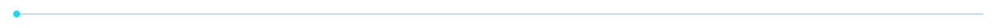
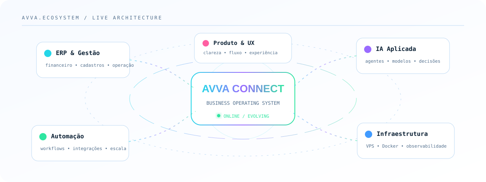

<!--
╔══════════════════════════════════════════════════════════════════════╗
║  README DE PERFIL — NICHOLAS GIL / AVVA CONNECT                    ║
║                                                                      ║
║  Perfil: github.com/Fiddlelandia                                    ║
║  Engenharia full-stack, sistemas de IA e produtos SaaS              ║
╚══════════════════════════════════════════════════════════════════════╝
-->

<div align="center">

<picture>
  <source media="(prefers-color-scheme: dark)" srcset="./assets/hero-dark.svg">
  <source media="(prefers-color-scheme: light)" srcset="./assets/hero-light.svg">
  
</picture>

<br>

<a href="https://git.io/typing-svg">
  
</a>

<br>

<a href="https://www.avvaconnect.com.br"></a>
<a href="https://github.com/Fiddlelandia"></a>
<a href="https://www.linkedin.com/in/nicholas-gil-87b8361b9"></a>
<a href="mailto:nicholasgildossantos@gmail.com"></a>


</div>

<picture>
  <source media="(prefers-color-scheme: dark)" srcset="./assets/divider-dark.svg">
  <source media="(prefers-color-scheme: light)" srcset="./assets/divider-light.svg">
  
</picture>

## `> whoami`

```yaml
name: Nicholas Gil
role: "Full-Stack Engineer & AI Systems Architect"
company: AVVA Connect
location: Brasil
mission: Criar sistemas inteligentes, claros e escaláveis para empresas reais.
current_focus:
  - ERP e gestão empresarial
  - automações operacionais
  - infraestrutura em VPS e Docker
  - sistemas cognitivos e IA aplicada
principles:
  - produto antes de complexidade
  - clareza antes de volume
  - automação antes de trabalho repetitivo
  - evolução contínua
```

<table>
<tr>
<td width="50%" valign="top">

### O que estou construindo

O **AVVA Connect** é um ecossistema de gestão empresarial orientado a produtividade, visão financeira e automação. Meu trabalho conecta produto, software, infraestrutura e inteligência artificial para reduzir atrito operacional.

- experiências SaaS mais claras;
- fluxos financeiros e administrativos;
- integrações e automações;
- ferramentas internas assistidas por IA;
- sistemas de IA com memória e raciocínio híbrido;
- infraestrutura simples de operar e evoluir.

</td>
<td width="50%" valign="top">

### Como eu penso produto

```text
problema real
    ↓
fluxo simples
    ↓
interface clara
    ↓
automação inteligente
    ↓
resultado mensurável
```

> Tecnologia útil é a que desaparece no fluxo e deixa o resultado aparecer.

</td>
</tr>
</table>

<picture>
  <source media="(prefers-color-scheme: dark)" srcset="./assets/ecosystem-dark.svg">
  <source media="(prefers-color-scheme: light)" srcset="./assets/ecosystem-light.svg">
  
</picture>

<picture>
  <source media="(prefers-color-scheme: dark)" srcset="./assets/divider-dark.svg">
  <source media="(prefers-color-scheme: light)" srcset="./assets/divider-light.svg">
  
</picture>

## `> tech.stack --active`

<div align="center">


<br><br>


</div>

## `> projects.list --featured`

<table>
<tr>
<td width="50%" valign="top">

### ◈ AVVA Connect

**ERP SaaS para gestão empresarial**

Produto central do ecossistema: financeiro, operação, cadastros, visibilidade e automação em uma experiência integrada.

`SaaS` `ERP` `Finanças` `Automação` `Produto`

[🌐 Acessar o site](https://www.avvaconnect.com.br)

</td>
<td width="50%" valign="top">

### ◈ AI & Automation Lab

**IA aplicada a fluxos reais**

Experimentos e soluções envolvendo agentes, roteamento de modelos, geração de conteúdo, análise e automações operacionais.

`OpenRouter` `OpenAI` `Gemini` `Agentes` `Workflows`

[⌁ Ver no GitHub](https://github.com/Fiddlelandia?tab=repositories)

</td>
</tr>
<tr>
<td width="50%" valign="top">

### ◈ Infrastructure Stack

**Ambiente de desenvolvimento e operação em VPS**

Docker, proxy reverso, serviços internos, observabilidade e organização de ferramentas para desenvolvimento assistido por IA.

`Docker` `Linux` `Nginx` `VPS` `DevOps`

[⌁ Explorar projetos](https://github.com/Fiddlelandia?tab=repositories)

</td>
<td width="50%" valign="top">

### ◈ Product Experience

**Interfaces orientadas a clareza e conversão**

Landing pages, sistemas internos e experiências de produto com foco em hierarquia visual, movimento e redução de fricção.

`UX/UI` `React` `Motion` `Design Systems` `Figma`

[✦ Conhecer o AVVA](https://www.avvaconnect.com.br)

</td>
</tr>
</table>

<picture>
  <source media="(prefers-color-scheme: dark)" srcset="./assets/divider-dark.svg">
  <source media="(prefers-color-scheme: light)" srcset="./assets/divider-light.svg">
  
</picture>

## `> github.metrics --live`

<div align="center">

<picture>
  <source media="(prefers-color-scheme: dark)" srcset="https://github-readme-stats.vercel.app/api?username=Fiddlelandia&show_icons=true&include_all_commits=true&count_private=true&hide_border=true&locale=pt-br&title_color=24D6E8&icon_color=9A6BFF&text_color=91A8BE&bg_color=07111F">
  <source media="(prefers-color-scheme: light)" srcset="https://github-readme-stats.vercel.app/api?username=Fiddlelandia&show_icons=true&include_all_commits=true&count_private=true&hide_border=true&locale=pt-br&title_color=087F8C&icon_color=7048D8&text_color=405D78&bg_color=FFFFFF">
  
</picture>

<picture>
  <source media="(prefers-color-scheme: dark)" srcset="https://github-readme-stats.vercel.app/api/top-langs/?username=Fiddlelandia&layout=compact&langs_count=8&hide_border=true&title_color=24D6E8&text_color=91A8BE&bg_color=07111F">
  <source media="(prefers-color-scheme: light)" srcset="https://github-readme-stats.vercel.app/api/top-langs/?username=Fiddlelandia&layout=compact&langs_count=8&hide_border=true&title_color=087F8C&text_color=405D78&bg_color=FFFFFF">
  
</picture>

<br>

<picture>
  <source media="(prefers-color-scheme: dark)" srcset="https://streak-stats.demolab.com?user=Fiddlelandia&hide_border=true&locale=pt_BR&background=07111F&ring=9A6BFF&fire=2FE6A1&currStreakLabel=24D6E8&sideLabels=91A8BE&dates=617C97&currStreakNum=F2FAFF&sideNums=F2FAFF">
  <source media="(prefers-color-scheme: light)" srcset="https://streak-stats.demolab.com?user=Fiddlelandia&hide_border=true&locale=pt_BR&background=FFFFFF&ring=7048D8&fire=0FA86E&currStreakLabel=087F8C&sideLabels=526F8D&dates=7891A8&currStreakNum=0B1F33&sideNums=0B1F33">
  
</picture>

<br>

<picture>
  <source media="(prefers-color-scheme: dark)" srcset="https://github-readme-activity-graph.vercel.app/graph?username=Fiddlelandia&bg_color=07111F&color=91A8BE&line=24D6E8&point=9A6BFF&area=true&hide_border=true&custom_title=Fluxo%20de%20contribui%C3%A7%C3%B5es">
  <source media="(prefers-color-scheme: light)" srcset="https://github-readme-activity-graph.vercel.app/graph?username=Fiddlelandia&bg_color=FFFFFF&color=526F8D&line=087F8C&point=7048D8&area=true&hide_border=true&custom_title=Fluxo%20de%20contribui%C3%A7%C3%B5es">
  
</picture>

</div>

## `> contribution.snake --run`

<div align="center">

<picture>
  <source media="(prefers-color-scheme: dark)" srcset="https://raw.githubusercontent.com/Fiddlelandia/Fiddlelandia/output/github-contribution-grid-snake-dark.svg">
  <source media="(prefers-color-scheme: light)" srcset="https://raw.githubusercontent.com/Fiddlelandia/Fiddlelandia/output/github-contribution-grid-snake.svg">
  
</picture>

</div>

<picture>
  <source media="(prefers-color-scheme: dark)" srcset="./assets/divider-dark.svg">
  <source media="(prefers-color-scheme: light)" srcset="./assets/divider-light.svg">
  
</picture>

## `> connect --open`

<div align="center">

**Construindo algo que precisa de produto, automação, IA ou infraestrutura?**

<br>

<a href="https://www.avvaconnect.com.br"></a>
<a href="https://www.linkedin.com/in/nicholas-gil-87b8361b9"></a>
<a href="mailto:nicholasgildossantos@gmail.com"></a>

<br><br>


<sub>Designed around product, clarity and continuous evolution.</sub>

</div>
